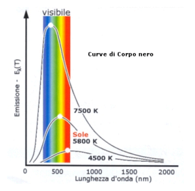

# Capitolo 1: Le basi storiche della Meccanica Quantistica

Si pensava che la fisica classica(gravitazione, elettromagnetismo, meccanica classica) fosse in grado di spiegare tutti i fenomeni fisici. $\\$
Nel XIX secolo, due eventi hanno messo in crisi la fisica classica:
- Michelson e Morley (1887) dimostrarono che la velocità della luce è costante in tutti i sistemi di riferimento inerziali. Da cui, successivamente, Einstein dedusse la relatività ristretta.
- Reileigh e Jeans (1900) dimostrarono che la radiazione di corpo nero non poteva essere spiegata dalla fisica classica. Da cui, successivamente, Planck dedusse la quantizzazione dell'energia.

Da questi eventi, si è sviluppata la fisica quantistica, che ha portato alla nascita della meccanica quantistica. $\\$

## 1.1 La scoperta dell'elettrone

Geissler osservò che avendo un tubo di vetro a vuoto e applicando una forte tensione tra i due elettrodi, dal catodo esce una radiazione che si propaga in linea retta verso l'anodo. Goldstein chiama questa radiazione "raggi catodici". $\\$
Crooks creò un nuovo tubo e dimostrò che:
- i raggi catodici si propagano in linea retta
- i raggi catodici posseggono energia cinetica e quantità di moto
- i raggi catodici sono deviati da un campo magnetico

Questi risultati evidenziano che si tratta di un raggio di particelle, che Perrin dimostrò essere cariche negativamente. $\\$
Thomson dimostrò il rapporto tra carica e massa di queste particelle. Se un raggio catodico entra in un campo elettrico, esso viene deviato. Se le particelle hanno tutte la stessa carica *q* e la stessa massa *m*, allora misurando la deviazione si può calcolare:
$$\frac{q}{m} = 1.76 \times 10^{11} \frac{C}{kg}$$

Thomson stimò una carica compresa nell'intervallo $-2 \cdot 10^{-19}C<q<-1 \cdot 10^{-19}C$, da cui si stima una massa dell'order di $10^{-27}g$. $\\$
A queste particelle viene dato il nome di "elettroni". $\\$

Dopo le misurazioni di Millikan, sappiamo che la carica dell'elettrone è pari a *-e*, dove:
$$e = 1.602189(5) \cdot 10^{-19}C$$

La sua massa è:
$$m_e = 9.10953(5) \cdot 10^{-27}g$$

Definendo l'elettronVolt come l'energia che acquista un elettrone quando attraversa una differenza di potenziale di 1V, si ha:
$$1eV = 1.602189(5) \cdot 10^{-12}erg$$

L'energia a riposo dell'elettrone è:
$$m_ec^2 = 0.511003(1)MeV$$

## 1.2 Modelli atomici di Thomson e di Rutherford

L'elettrone ha una massa 1840 volte inferiore a quella di un atomo di idrogeno e 1839 volte inferiore a quella di un protone. $\\$
Thomson propose un modello atomico in cui palle di $10^{-8}cm = 1 \AA$ di raggio, cariche positivamente(pari al numero atomico Z), con all'interno elettroni, che diminuivano la carica totale in modo da mantenere l'atomo neutro. $\\$
Rutherford bombardò una lamina d'oro con particelle $\alpha$ e osservò che buona parte delle particelle subivano forti deviazioni. Ne concluse che l'atomo è formato da un nucleo di dimensioni $10^{-13}cm = 1fm$ e da elettroni che ruotano attorno ad esso. $\\$
Il nucleo veniva, quindi, spiegato ancora in termini di soli protoni(A) ed elettroni(A-Z). $\\$
Successivamente si scoprì che il nucleo è formato anche da neutroni(A-Z). $\\$
Seguendo le leggi di Maxwell, però, un elettrone che ruota attorno ad un nucleo(carica accelerata) dovrebbe emettere radiazione elettromagnetica e perdere energia. Eseguendo i calcoli, si scopre che l'elettrone dovrebbe collassare sul nucleo in $10^{-8}s$. Poichè gli atomi sono stabili, si deve trovare un nuovo modello atomico. $\\$

## 1.3 La radiazione di corpo nero

Un corpo nero è un corpo che assorbe tutta la radiazione elettromagnetica incidente su di esso. $\\$
La radiazione eccita le pareti(visti come oscillatori carichi) del corpo nero, che emettono radiazione di qualunque lunghezza d'onda. $\\$
Dopo un certo tempo, si raggiunge un equilibrio termico tra la radiazione e le pareti a temperatura T. $\\$
Si opera un piccolo foro in una delle pareti, in modo da non perturbare l'equilibrio termico, e si misura la radiazione che esce dal foro. $\\$
Le osservazioni sperimantali sono:
- *Legge di Stefan-Boltzmann*: l'energia emessa per unità di tempo e di superficie è proporzionale alla quarta potenza della temperatura 
$$R = \sigma T^4$$
- *Distribuzionedi intensità in funzione della lunghezza d'onda*: la distribuzione di intensità di radiazione è come in figura. Incrementando la temperatura, la curva rimane la stessa ma si sposta verso lunghezze d'onda minori. $\\$

- *Legge di Wien*: i massimi di intensità(energia in funzione della lunghezza d'onda) seguono una legge di proporzionalità inversa con la temperatura
$$\lambda_{max}= \frac{\alpha}{T}$$

Rayleigh e Jeans tentarono di spiegare la radiazione di corpo nero proponendo una legge per l'intensità in funzione della lunghezza d'onda. $\\$
$$I(\lambda) \propto \frac{T}{\lambda^4}$$

Il problema è che questa legge prevede un'energia infinita per lunghezze d'onda piccole. $\\$
Vediamo comunque il loro approccio. $\\$
Vogliamo calcolare la densità di energia di radiazione contenuta nella cavità di frequenza tra $v$ e $v + dv$. $\\$
$$\rho(v)dv = \bar{\epsilon}N(v)dv$$

Dove $\bar{\epsilon}$ è l'energia media degli oscillatori delle pareti in risonanza con la radiazione di frequenza $v$ e $N(v)$ è il numero di onde stazionarie all'interno della cavità, assumiamo di forma cubica di lato L. $\\$
Un'onda stazionaria ha nodi:$\\$
$$n_i = \frac{2L}{\lambda_i}cos(\theta_i)$$

Dove $\theta_i$ è l'angolo tra la direzione di propagazione dell'onda e la direzione del lato L. $\\$
Da cui ottengo l'equazione dei punti a coordinate intere positive o nulle sulla sfera di raggio $R = \frac{2vL}{c}$:
$$n_1^2 + n_2^2 + n_3^2 = \frac{4v^2L^2}{c^2}$$

Quindi se conto il numero d onde stationarie tra $v$ e $v + dv$:
$$N(v)dv = 8\pi \frac{v^2dv}{c^3}$$

La densità si ottiene calcolando l'energia media degli oscillatori delle pareti in risonanza con il numero di onde stazionarie.$\\$
Per calcolare l'energia media, usiamo la media statistica:
$$\bar{\epsilon} = \frac{\int_0^{\infty} \epsilon e^{-\beta \epsilon}d\epsilon}{\int_0^{\infty} e^{-\beta \epsilon}d\epsilon}= \frac{1}{\beta} = kT$$

Dove $\beta = \frac{1}{kT}$ è il parametro di Boltzmann. $\\$
Otteniamo così il teorema di *equipartizione dell'energia*. $\\$
Quindi possiamo scrivere la densità di energia di radiazione:
$$\rho(v)dv = 8\pi kT \frac{v^2}{c^3}dv$$

Quindi ricordando che la frequenza è legata alla lunghezza d'onda dalla relazione $\lambda = \frac{c}{v}$, otteniamo che $dv = -\frac{c}{\lambda^2}d\lambda$. $\\$
Che infine ci danno la legge di Rayleigh-Jeans:
$$\rho(\lambda)= 8\pi \frac{kT}{\lambda^4}$$

Qui la radiazione è trattata come un'onda che, ad ogni frequenza, può essere emessa con qualunque energia. Esso diverge con i risultati sperimentali e diverge per lunghezze d'onda piccole, prevedendo quindi grandi emissioni per lunghezze d'onda dell'ultravioletto e raggi X. Questa viene chiamata *catastrofe ultravioletta*. $\\$

Plancl ipotizzò che la radiazione potesse essere emessa solo a pacchetti discreti di energia, chiamati *quanti*. I quali per ogni frequenza potevano trasportare un'energia $\epsilon = hv$, con $h = 6.62618(4) \cdot 10^{-27}erg \cdot s$ fissata sperimentalmente(ha le dimensioni di un'azione). $\\$
Questo modifica il calcolo del valore medio dell'energia degli oscillatori delle pareti in risonanza con la radiazione di frequenza $v$:
$$\bar{\epsilon} = \frac{\int_0^{\infty} \epsilon_n e^{-\beta \epsilon_n}}{\int_0^{\infty} e^{-\beta \epsilon_n}} = - \frac{d}{d\beta}log \frac{1}{1-e^{-\beta hv}} $$

Ciò porta alla nota legge di Planck per l'intensità di spettro di radiazione di corpo nero:
$$\rho(\lambda) = \frac{8\pi hc}{\lambda^5} \frac{1}{e^{\frac{hc}{\lambda kT}}-1}$$

Da cui si possono ricavare le leggi di Stefan-Boltzmann e di Wien. Definiamo quindi la densità totale di energia di radiazione:
$$\rho = \frac{8\pi^5k^4}{15c^3h^\frac{3}{2}}T^4$$

Si osserva l'andamento dell'intensità di radiazione in temrini di $T^4$. $\\$
Vediamo che anche la legge di Wien è verificata. $\\$

Vediamo, quindi, in conclusione, che la radiazione di corpo nero è spiegata solo se si considera la radiazione come composta da quanti di energia. $\\$

## 1.4 Effetto fotoelettrico

Newton aveva ipotizzato che la luce fosse composta da particelle, questo però andava contro la teoria ondulatoria di Huygens. $\\$
Einstein aveva dubbi basati principalmente sull'effetto fotoelettrico, infatti, Hertz aveva messo in evidenza sin dal 1887 che illuminando una superficie metallica con luce di una certa frequenza, essa emetteva elettroni. $\\$
L'energia cinetica dell'elettrone è data da:
$$\epsilon_c = \frac{1}{2}m_ev^2 = eV$$

Dove V è la differenza di potenziale tra la superficie metallica e la superficie di riferimento. $\\$
Empiricamente si osserva che:
- l'effetto fotoelettrico si verifica solo se la frequenza della luce è maggiore di una certa frequenza critica $v_0$
- l'energia cinetica degli elettroni emessi è indipendente dall'intensità della luce, ma dipende dalla frequenza della luce
- il numero di elettroni emessi è proporzionale all'intensità della luce 
- il tempo di emissione degli elettroni è indipendente dall'intensità della luce e sempre inferiore a $10^{-9}s$

L'ipotesi ondulatoria non riusciva a spiegare questi fenomeni contemporaneamente in quanto diceva che:
- l'energia che giunge ad un atomo fa vibrare l'elettrone finchè, raggiunta una certa soglia, viene emesso. Quindi l'effetto fotoelettrico si dovrebbe verificare solo per un intensità sufficientemente alta, non per una frequenza sufficientemente alta
- l'energia cinetica degli elettroni emessi dovrebbe dipendere dall'intensità della luce, non dalla frequenza
- il tempo di emissione degli elettroni dovrebbe dipendere dall'intensità della luce e sarà sufficientemente lungo

Einstein, quindi, ipotizzò che la luce fosse composta da quanti di energia, chiamati fotoni, che trasportano un'energia $hv$ e con massa a riposo nulla. $\\$
Oltre all'energia cinetica, il fotone trasporta anche un impulso:
$$p = \frac{hv}{c} = \frac{h}{\lambda}$$
$$\epsilon_c = hv$$

Quindi ogni colore di luce è composto da fotoni di energia diversa. $\\$
Adesso le osservazioni sperimentali sono spiegate:
- per staccare un eletrone dall'atomo, il fotone deve avere un'energia maggiore di quella di legame dell'elettrone. Quindi ci sono due scenare:
    - $hv < \epsilon_0$: l'energia del fotone è inferiore a quella di legame dell'elettrone, quindi l'elettrone non viene staccato
    - $hv > \epsilon_0 \equiv hv_0$: l'energia ceduta all'elettrone viene in parte trasformata in energia cinetica e in parte in energia potenziale per staccare l'elettrone dall'atomo
- un maggiore numero di fotoni, quindi intensità maggiore, aumenta il numero di elettroni emessi
- l'effetto di emissione degli elettroni è istantaneo, in quanto l'energia viene trasferita istantaneamente dall'onda al fotone

## 1.5 Effetto Compton  

Un'altra conferma dell'ipotesi dei fotoni è l'effetto Compton. $\\$
Compton bombardò un bersaglio di carbonio con raggi X e osservò che i raggi diffusi avevano una lunghezza d'onda maggiore di quelli incidenti($\lambda' > \lambda$). La differenza di lunghezza d'onda è proporzionale all'angolo di diffusione.$$\lambda' - \lambda = \lambda_c(1-cos\theta)$$

Dove $\lambda_c = 2.4 \cdot 10^{-10}cm$ misurata sperimentalmente. $\\$
Questo effetto si spiega considerando un urto elastico tra un fotone($\gamma$) e un elettrone libero. $\\$
La conservazione dell'energia e dell'impulso ci danno:
$$E_{\gamma} + E_e = E_{\gamma}' + E_e'$$
$$p_{\gamma} + p_e = p_{\gamma}' + p_e'$$

Da cui otteniamo che la conservazione dell'energia ci dà:
$$hv + m_ec^2 = hv' + Mc^2$$

Dove $M = \frac{m_e}{\sqrt{1-\frac{v^2}{c^2}}}$ è la massa dell'elettrone in moto. $\\$
la conservazione dell'impulso del raggio incidente ci dà:
$$\frac{hv}{c} = \frac{hv'}{c}cos\theta + Mv cos\phi$$

Quella perpendicolare ci dà:
$$0 = \frac{hv'}{c}sin\theta - Mv sin\phi$$

Da cui otteniamo che:
$$1-cos\theta = \frac{m_ec^2}{h} \frac{v - v'}{vv'}$$

Che riscritta in funzione delle lunghezze d'onda ci dà:
$$\lambda' - \lambda = \frac{h}{m_ec}(1-cos\theta)$$

In pieno accordo con i risultati sperimentali, dove $\lambda_c$ è chiamata *lunghezza d'onda di Compton*. $\\$

## 1.6 Atomo di Bohr

Gli studi di spettroscopia avevano mostrato che l'atomo emette radiazione solo a determinate frequenze, non in modo continuo. $\\$
In particolare, esaminando un gas di idrogeno, Balmer scoprì che le frequenze di emissione erano date da:
$$v_n = cR(\frac{1}{4} - \frac{1}{n^2})$$

Dove $R = 109677.576cm^{-1}$ è la costante di Rydberg e $n = 3,4,5,...$ è il numero quantico principale. $\\$
Rydberg e Ritz scoprirono che le frequenze di emissione di tutti gli elementi potevano essere scritte come:
$$v_{m,n} = cR(\frac{1}{m^2} - \frac{1}{n^2})$$

Dove $m = 1,2,3,...$ e $n = m+1,m+2,...$ sono i numeri quantici principali. $\\$
Mancava una spiegazione teorica per questi risultati. Quindi Bohr ipotizzò che:
- un atomo ha un insieme discreto di stati stazionari con energia fissata $E_1,E_2,...$
- l'emissione e l'assorbimento di radiazione avvengono solo quando l'atomo passa da uno stato stazionario ad un altro
- un elettrone in uno stato stazionario descrive un orbita circolare classica
- le orbite stazionarie vengono detemrinate dalla condizione che l'impulso angolare orbitale sia quantizzato, quindi $|l| = n\hbar$

Ogni orbita è caratterizzata quindi da un momento angolare e viene etichettata con un numero quantico $n = 1,2,3,...$ $\\$
Quindi l'energia di un elettrone nell'orbita n-esima è data dalla somma dell'energia cinetica e potenziale coloumbiana tra le cariche del protone e dell'elettrone:
$$E_n = T_n + V_n = \frac{1}{2}m_ev_n^2 - \frac{e^2}{r_n}$$

Per orbite circolari, l'accelerazione è unicamenta centripeta e quindi:
$$E_n = -\frac{1}{2}m_ev_n^2 = -\frac{e^2}{2r_n}$$

La quantizzazione del momento ancorlare ci dà:
$$r_n = \frac{n^2\hbar^2}{m_ee^2}$$

Quindi i raggi delle orbite($r_n$) sono quantizzati in modo proporzionale a $n^2$, quindi le velocità decrescono con $\frac{1}{n}$.
$$v_n = \frac{e^2}{n\hbar}$$

La dimensione tipica dell'atomo di idrogeno è $r_1 \approx 0.53 \AA$. Insersendo tutti i dati, otteniamo che l'energia dell'orbita n-esima è:
$$E_n = -\frac{m_ee^4}{2\hbar^2}\frac{1}{n^2}$$

La differenza di energia tra due orbite n-esima e m-esima viene emessa con un fotone di frequenza:
$$v_{m,n} = \frac{E_m - E_n}{h} = \frac{\pi m_ee^4}{\hbar^3}(\frac{1}{m^2} - \frac{1}{n^2})$$

Che è in accordo con i risultati sperimentali. $\\$
Le energie degli stati legati sono negative(abbiamo posto il livello 0 di energia pari all'energia di fuga dell'elettrone). $\\$
L'energia di ionizzazione è pari alla differenza tra l'energia di fuga e quella dello stato fondamentale($E_1 = -13.59eV$), quindi:
$$E_{ion} = 13.59eV$$
