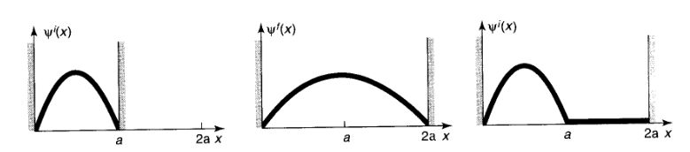
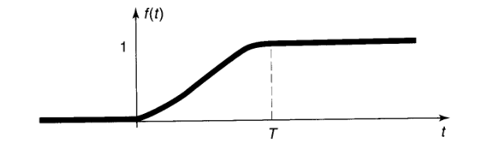
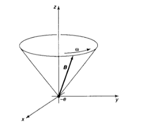
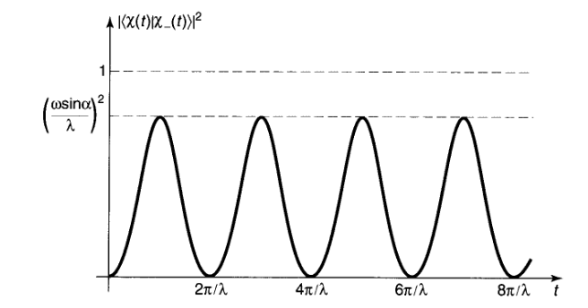

# Capitolo 10: Approssimazione adiabatica

## 10.1 Teorema Adiabatico

### 10.1.1 Processi adiabatici

Partiamo da un esempio di un pendolo classico, senza attrito o resistenza dell'aria, che oscilla su un piano verticale.$\\$
Se il pendolo viene spostato in maniera gentile e lenta, il pendolo si continuerà a muovere in maniera armonica sullo stesso piano e con la stessa ampiezza. Questo graduale cambio delle condizioni esterne è un esempio di un processo adiabatico.$\\$
Per spiegarlo meglio, facciamo notare che ci sono due caratteristiche temporali differenti che influenzano il moto del pendolo: il tempo interno $T_i$ e il tempo esterno $T_e$. Il tempo interno è il tempo che il pendolo impiega per completare un'oscillazione, mentre il tempo esterno è il tempo che, se il pendolo fosse messo su una piattaforma oscillante, impiegherebbe il sistema a cambiare in maniera significativa.$\\$
Il processo adiabito è un processo in cui $T_e >> T_i$. Questo significa che il sistema ha abbastanza tempo per adattarsi alle condizioni esterne.$\\$

Normalmente si approcciano questi processi mantenendo fissati i parametri esterni, che verranno cambiati in maniera graduale nel tempo a fine dei calcoli.$\\$
Per esempio, se prendiamo il periodo classico di un pendolo di lunghezza $l$ sarà $T_i = 2\pi\sqrt{\frac{l}{g}}$. Se, però vogliamo cambiare la lunghezza del pendolo in maniera graduale, possiamo scrivere $T_i = 2\pi\sqrt{\frac{l(t)}{g}}$.$\\$

In meccanica quantistica, possiamo descrivere il teorema adiabatico come segue: supponiamo che l'Hamiltoniana di un sistema cambi gradualmente da una forma iniziale $H_i$ ad una forma finale $H_f$. Se il sistema è inizialmente nell'autostato n-esimo di $H_i$, allora il sistema verrà portato(utilizzando l'equazione di Schrödinger) nell'autostato n-esimo di $H_f$. (Assumiamo che lo spettro sia discreto e non degenere).$\\$

Per esempio, supponiamo di avere una particella nello stato fondamentale di una buca di potenziale infinita:
$$ \psi^{i}(x) = \sqrt{\frac{2}{a}}\sin(\frac{\pi x}{a})$$

Se la muoviamo gradualmente il muro destro fino a $2a$, il teorema adiabatico ci dice che la particella si troverà nello stato fondamentale della nuova buca di potenziale:
$$ \psi^{f}(x) = \sqrt{\frac{1}{a}}\sin(\frac{\pi x}{2a})$$

Da notare che il cambiamento nell'Hamiltoiana non è piccolo come nella teoria perturbativa, è grande, ma graduale.$\\$
In contrasto se il cambiamento avvenisse improvvisamente, la particella non avrebbe il tempo di adattarsi e rimarrebbe nello stato iniziale $\psi^{i}(x)$, questa volta scritto come complicata combinazione lineare degli autostati di $H_f$.$\\$

### 10.1.2 Dimostrazione del teorema adiabatico

Supponiamo che l'Hamiltoniana dipendente dal tempo sia data da:
$$ H'(t) = V f(t)$$

Dove $f(t)$ è una funzione che inizia da 0 e va a 1 quando $t = T$.$\\$

Assumiamo che la particella inizi nello stato n-esimo dell'Hamiltoniana originale:
$$ \psi(0) = \psi_n^{i}$$

Ed evolve in un qualche stato $\psi(t)$.$\\$
Dobbiamo dimostrare che se $f(t)$ cambia in maniera graduale, allora la probabilità che la particella si trovi nello stato n-esimo dell'Hamiltoniana finale $\psi_n^{f}$, a tempo $T$, è 1.$\\$
Più precisamente ci interessa dimostrare che:
$$ |\braket{\psi(T)|\psi_m^{f}}|^2 = \left\{ \begin{array}{ll} 1 & \text{se } m = n \\ 0 & \text{se } m \neq n \end{array} \right.$$

Assumiamo, per il momento, che $V$ sia piccolo così che possiamo utilizzare la teoria perturbativa di primo ordine *indipendente* dal tempo per determinare $\psi_m^{f}$.$\\$
$$ \psi_m^{f} \simeq \psi_m + \sum_{k \neq m} \frac{V_{km}}{E_m - E_k} \psi_k$$

Tolgo la $i$ per semplicità.$\\$
Dove $V_{km} \equiv \braket{\psi_k|V|\psi_m}$.$\\$
Mentre utilizzeremo la teoria perturbativa di primo ordine *dipendente* dal tempo per determinare $\psi(T)$.$\\$
$$ \psi(t) = \sum_{l} c_l(t) \psi_l e^{-iE_l \frac{t}{\hbar}}$$

Dove:
$$ c_n(t) \simeq 1 - \frac{i}{\hbar} V_{nn} \int_{0}^{t} f(t') dt'$$

E:
$$ c_l(t) \simeq -\frac{i}{\hbar} V_{ln} \int_{0}^{t} f(t') e^{i(E_l - E_n) \frac{t'}{\hbar}} dt'$$

Per $l \neq n$.$\\$
Quest'ultimo integrale può essere valutato con la formula di integrazione per parti. Sapendo che:
$$ e^{i(E_l - E_n) \frac{t'}{\hbar}} = \frac{-i\hbar}{E_l - E_n} \frac{d}{dt'} \left[ e^{i(E_l - E_n) \frac{t'}{\hbar}} \right]$$

Otteniamo:
$$ c_l(t) \simeq -\frac{V_{ln}}{E_l - E_n} \left[ f(t) e^{i(E_l - E_n) \frac{t}{\hbar}} - \int_{0}^{t} \frac{df}{dt'} e^{i(E_l - E_n) \frac{t'}{\hbar}} dt' \right]$$

Tolgo il limite inferiore in quanto $f(0) = 0$.$\\$
Adesso implementiamo l'approssimazione adiabatica. Supponiamo che $f(t)$ cambi in maniera graduale, così che $\frac{df}{dt}$ sia piccolo.$\\$
Specificamente, assumiamo che:
$$ \frac{df}{dt} \ll \frac{|E_l - E_n|}{\hbar}f$$

Così che l'ultimo termine nell'equazione precedente sia trascurabile, quindi possiamo concludere che:
$$ \psi(T) \simeq \left[ \left( 1 - i\frac{V_{nn}A}{\hbar} \right) \psi_n - \sum_{l \neq n} \frac{V_{ln}}{E_l - E_n} \psi_l \right] e^{-iE_n \frac{T}{\hbar}}$$

Dove $A$ è l'area sottesa da $f(t)$ tra $t = 0$ e $t = T$.$\\$
Ora mettiamo tutto insieme. Utilizziamo l'ortonormalità degli autostati dell'Hamiltoniana iniziale e troviamo che:
$$ \braket{\psi(T)|\psi_m^{f}} = \left[ 1 + i\frac{V_{nn}A}{\hbar} + \sum_{k \neq n} \frac{|V_{kn}|^2}{(E_n - E_k)^2} \right] e^{-iE_n \frac{T}{\hbar}}$$

Se $m = n$, mentre se $m \neq n$:
$$ \braket{\psi(T)|\psi_m^{f}} = \left[ \frac{iAV_{nn}V_{nm}}{\hbar(E_m - E_n)} + \sum_{n \neq k \neq m} \frac{V_{nk}V_{km}}{(E_n - E_k)(E_m - E_k)} \right] e^{-iE_n \frac{T}{\hbar}} \space \space [10.z]$$

Queste funzioni sono solo accurate al primo ordine in $V$, quindi i termini di ordine superiore sono spuri.$\\$
Per il primo ordine abbiamo che:
$$ \braket{\psi(T)|\psi_m^{f}} = \left\{ \begin{array}{ll} \left[ 1 + i\frac{V_{nn}A}{\hbar} \right] e^{-iE_n \frac{T}{\hbar}} & \text{se } m = n \\ 0 & \text{se } m \neq n \end{array} \right.$$

Quindi:
$$ |\braket{\psi(T)|\psi_m^{f}}|^2 = 1 \space \space [10.x]$$

Per $m = n$, mentre per $m \neq n$:
$$ |\braket{\psi(T)|\psi_m^{f}}|^2 = 0 \space \space [10.y]$$

Solo che la $[10.x]$ è giusta solo al primo ordine in $V$, mentre la $[10.y]$ è giusta al secondo. Quindi la $[10.x]$ non ci dice nulla(in quanto sarebbe valida anche per trasformazioni non adiabatiche), il punto cruciale è la cancellazione dei termini di primo ordine nell'equazione $[10.z]$ che ci dice che non ci saranno transizioni ad altri stati(rimarrà nello stato iniziale come volevamo).$\\$
Questo dimostra che se i cambiamenti nell'Hamiltoniana sono adiabatici e molto lenti(così che la teoria perturbativa di primo ordine sia valida), allora il sistema rimarrà nello stato iniziale quindi non ci saranno transizioni.$\\$

Ma se i cambiamenti fossero sempre grandi, ma più grandi? In questo caso basta suddividere l'intervallo di tempo $T$ in $N$ intervalli di tempo, così che il cambiamento nell'Hamiltoniana durant eun singolo intervallo($\Delta V$) sia dell'ordine di $\frac{V}{N}$. Se $N$ è grande, allora $\delta V$ sarà piccolo e la teoria perturbativa sarà valida.$\\$
Se, quindi l'ampiezza(Equazione $[10.z]$) è nel primo ordine di perturbazione, allora la transizione di ampiezza sarà del tipo:
$$ N \left( \frac{V}{N} \right) \rightarrow V$$

($N$ passi di ampiezza proporzionale a $\delta V$).$\\$
Il risultato sarà dell'ordine di $V$, quindi se $V$ è grande, allora la transizione sarà grande.$\\$
Ma, in realtà, la transizione è di secondo ordine, quindi il totale va:
$$ N \left( \frac{V}{N} \right)^2 \rightarrow \frac{V^2}{N}$$

Che nel limite $N \rightarrow \infty$ va a 0 indipendentemente da quanto grande sia $V$.$\\$

### 10.1.3 Esempio
Immaginiamo di avere un elettrone(carica $-e$ e massa $m$) a riposo nell'origine di un sistema di riferimento in cui c'è un campo magnetico di magnitudine $B_0$ costante, am con la direzione che crea un cono di apertura $\alpha$ a velocità angolare costante $\omega$.$\\$

L'operatore del campo magnetico è:
$$ B(t) = B_0 \left[ \sin(\alpha) \cos(\omega t) \sigma_x + \sin(\alpha) \sin(\omega t) \sigma_y + \cos(\alpha) \sigma_z \right]$$

L'Hamiltoniana è:
$$ H(t) = \frac{e}{m} B \cdot S = \frac{e\hbar B_0}{2m} \left[ \sin(\alpha) \cos(\omega t) \sigma_x + \sin(\alpha) \sin(\omega t) \sigma_y + \cos(\alpha) \sigma_z \right] = -\frac{\hbar \omega_1}{2} \left( \begin{array}{cc} \cos(\alpha) & e^{-i\omega t} \sin(\alpha) \\ e^{i\omega t} \sin(\alpha) & -\cos(\alpha) \end{array} \right)$$

Dove $\omega_1 = -\frac{eB_0}{m}$.$\\$
Gli autospinori dell'Hamiltoniana sono:
$$ \chi_{+}(t) = \left( \begin{array}{c} \cos(\frac{\alpha}{2}) \\ e^{i\omega t} \sin(\frac{\alpha}{2}) \end{array} \right) \space \space \chi_{-}(t) = \left( \begin{array}{c} -e^{-i\omega t} \sin(\frac{\alpha}{2}) \\ \cos(\frac{\alpha}{2}) \end{array} \right)$$

Rappresentano rispettivamente lo spin up e lo spin down lungo la direzione del campo magnetico B(t).$\\$
I corrispondenti autovalori sono:
$$ E_{\pm} = \mp \frac{\hbar \omega_1}{2}$$

Supponiamo che l'elettrone parta con lo spin up lungo B(0):
$$ \chi(0) = \left( \begin{array}{c} \cos(\frac{\alpha}{2}) \\ \sin(\frac{\alpha}{2}) \end{array} \right)$$

La soluzione dell'equazione di Schrödinger dipendente dal tempo è:
$$ \chi(t) = \left( \begin{array}{c} \left[ \cos(\frac{\lambda t}{2}) + i\frac{\omega_1 + \omega}{\lambda} \sin(\frac{\lambda t}{2}) \right] \cos(\frac{\alpha}{2})e^{-i\omega \frac{t}{2}} \\ \left[ \cos(\frac{\lambda t}{2}) + i\frac{\omega_1 - \omega}{\lambda} \sin(\frac{\lambda t}{2}) \right] \sin(\frac{\alpha}{2})e^{i\omega \frac{t}{2}} \end{array} \right)$$

Dove $\lambda = \sqrt{\omega_1^2 + \omega^2 + 2\omega_1\omega \cos(\alpha)}$.$\\$
Oppure scritto come una combinazione lineare degli autospinori:
$$ \chi(t) = \left[ \cos(\frac{\lambda t}{2}) + i\frac{\omega_1 + \omega cos(\alpha)}{\lambda} \sin(\frac{\lambda t}{2}) \right] e^{-i\omega \frac{t}{2}} \chi_{+}(t) + i \left[ \frac{\omega}{\lambda} \sin(\alpha) \sin(\frac{\lambda t}{2}) \right] e^{-i\omega \frac{t}{2}} \chi_{-}(t)$$

Da qui capiamo che la probabilità di transizione ad uno spin down(lungo la direzione di B) è:
$$ |\braket{\chi(t)|\chi_{-}(t)}|^2 = \left[ \frac{\omega}{\lambda} \sin(\alpha) \sin(\frac{\lambda t}{2}) \right]^2 \space \space [10.k]$$

Il teorema adiabatico ci dice che la probabilità di transizione sparisce per il limite in cui $T_e \gg T_i$, dove $T_e$ è il tempo caratteristico per i cambiamenti nell'Hamiltoniana(in questo caso $\frac{1}{\omega}$) e $T_i$ è il tempo caratteristico per cambiamenti nella funzione d'onda(in questo caso $\frac{1}{\omega_1}$).$\\$
Quindi l'approssimazione adiabatica ci dice che $\omega \ll \omega_1$.$\\$
Il campo ruota lentamente, in confronto con la fase della funzione.$\\$
Nel regime adiabatico $\lambda \simeq \omega_1$, quindi la probabilità di transizione è:
$$ |\braket{\chi(t)|\chi_{-}(t)}|^2 \simeq \left[ \frac{\omega}{\omega_1} \sin(\alpha) \sin(\frac{\omega_1 t}{2}) \right]^2 \rightarrow 0$$

Il campo magnetico porta l'elettrone in giro, con lo spin sempre puntato nella direzione di B. In contrasto se $\omega \gg \omega_1$ allora $\lambda \simeq \omega$ e il sistema rimbalza tra spin up e spin down(figura sotto).$\\$

Graifco della transizione di probabilità equazione $[10.k]$, in un regime non adiabatico.$\\$
